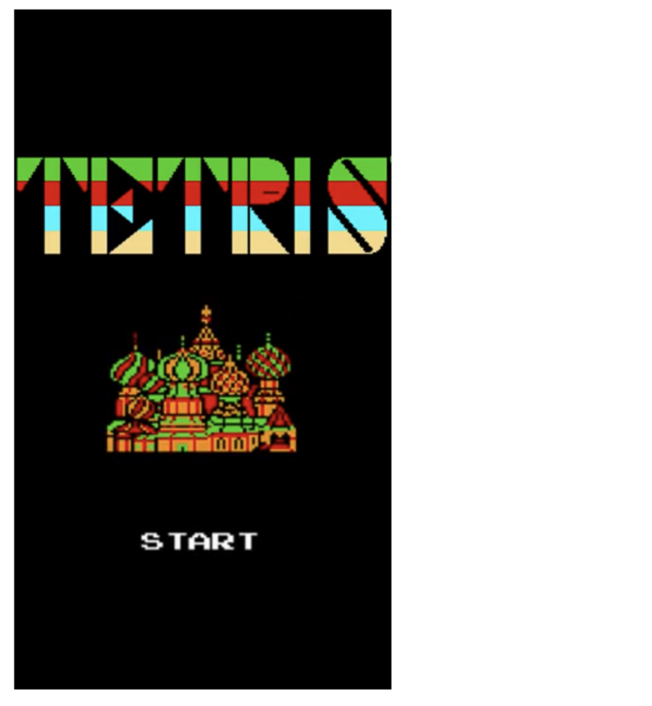
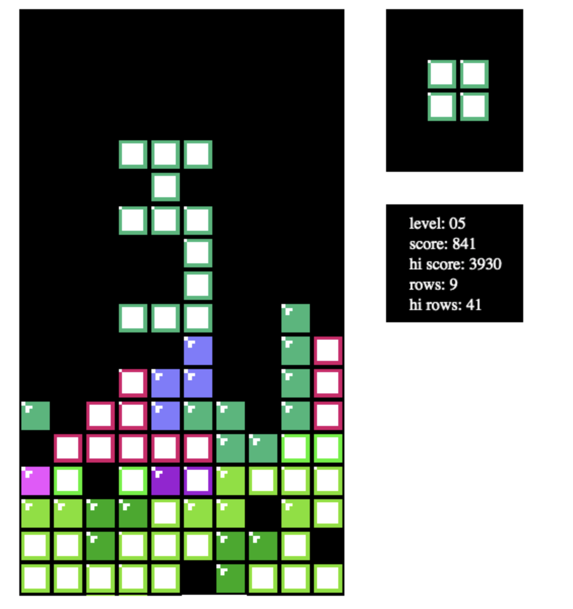

# It's Tetris, sort of!

Yeah! This project was a reason to use my Creek engine/framework/whatever a little bit to try to hone it into something more useful in general. You can play this game at [wcarss.ca/tetris](https://wcarss.ca/tetris).

### What's Creek?

Fancy you should ask! It's a game engine I wrote for the heck of it. You can check it out over at [its github.](https://github.com/wcarss/creek), or see a (very barebones) demo of it running [here](https://wcarss.ca/creek). It's very much a work in progress.

### Is this good code? Can I learn from this or make money from it?

Haha, no, probably not.

### Can I try anyway / use it somewhere though?

Yeah! Like Creek, this work is published under the MIT License. You can check out the specifics of what that entails in the License file. Don't worry about contacting me to use anything here, but if you have questions or want to anyway, hit me up at [carss.w@gmail.com](mailto:carss.w@gmail.com). I do welcome, encourage, and appreciate attribution.
